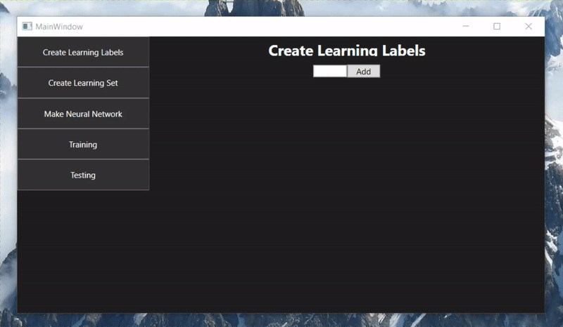
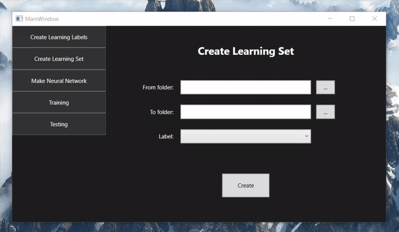
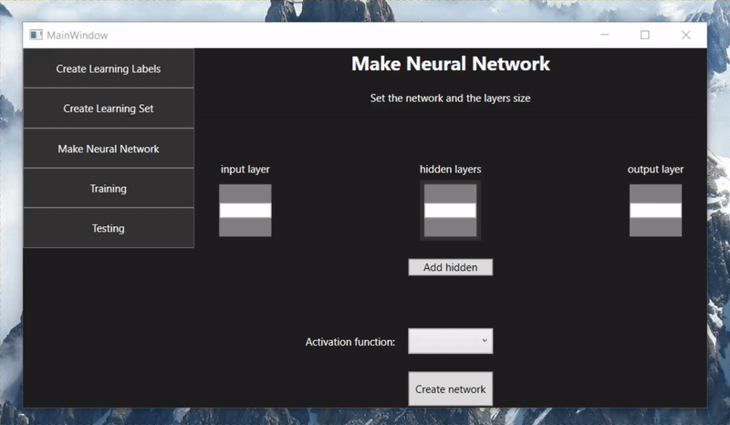
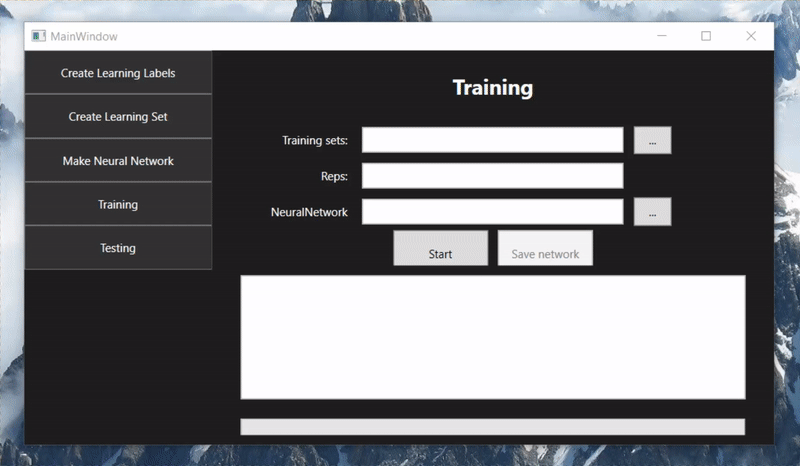
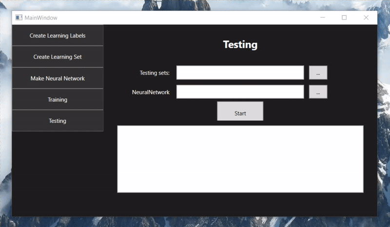

# EKE-PROBLEM-CLASSIFIER-WITH-NEURAL-NETWORK

Ez a projekt az Eszterházy Károly Egyetemmel együttműködve jött létre. A feladatom egy olyan szoftver lefejlesztése, mely egy problémáról előre kigyűjtött adatok alapján képes meghatározni annak a típusát ezáltal osztályozza azt. Ehhez neurális hálózatokat fogok használni. Az eredményeket és a szoftvert olyan formában kell közölni, mely közérthető és egyszerű a használata. Ez a projekt összefoglalja a korábbi eredményeket, módszereket és egységbe foglalja azt. Ebben a repozitoriban nyomon követhető a munkám.

**Felületek bemutatása**

**Problémaosztályokhoz tartozó címkék felvétele**

Az első és kötelező lépés az, hogy felvegyük a programba azokat az osztályokat (pontosabban az osztályokhoz tartozó egyedi címkét) melyeket meg szeretnénk különböztetni egymástól a hálózattal.

A címkék legyenek egyediek, a felépítése nem korlátozott illetve a címkék száma sem.

A címkék felvételéről szóló demó:

**Problémaosztályhoz tartozó tanuló/tesztelő adat készítése**

Amennyiben még nem készítettük el, úgy el kell készíteni a probléma osztályokhoz tartozó feladatok leképezését, ami alatt a feladatokról egy statisztika készül a háttérben. Ez a statisztika fogja a tanuló adatot képezni, melyet a neurális hálózat képes értelmezni.

Ehhez előzőleg a felismerendő problémaosztályokat mappákba kell szervezni úgy, hogy minden mappában csak a saját problématípushoz tartozó feladatok szerepeljenek. 

Amennyiben ezzel megvagyunk, akkor a programba betallózhatjuk azt a problémaosztályt (pontosabban annak a mappáját) amelyikről el szeretnénk készíteni a tanuló adatokat. Kiválaszthatjuk a mentés helyét illetve az előzőekben felvett címkék közül ki kell választanunk az osztály címkéjét, mert a neurális hálózat ez a címke alá fogja sorolni a betallózott feladatokat.

A tanuló/tesztelő adatok elkészítéséről a demó:

Ez a folyamat után az elkészített feladatokat érdemes 1 txt-be összeilleszteni, hogy a későbbi tanítási folyamatnál minden feladatot egyszerre tudjon tanulni a hálózat.

**Neurális hálózat elkészítése**

Amenniben még nem készítettük el a hálózatunkat, úgy azt is meg kell tennünk. Ezen a felületen lehetőségünk van tetszőleges hálózatot létrehozni. Változtatható a rétegek száma, a rétegen található neuronok száma és a használt aktivációs függvény is.

A bemeneti réteg neuronszámát a feladat statisztikájának elemszáma határozza meg, ebben az esetben ez mindig 48. 

A kimeneti réteg neuronszámát pedig a címkéink száma határozza meg. Jelenleg, mivel 31 különböző osztályt szeretnék megkülönböztetni ezért 31 ez a szám.

A rejtett rétegek számát és azon található neuronok számát pedig tetszőlegesen változtathatjuk. Minél több réteget illetve az egyes rétegen minél több neuront használunk, annál idő és tárigényesebb lesz a hálózat tárolása, tanítása, felhasználása.

Érdemes elgondolkozni a hálózat létrehozásakor azon, hogy elegendő-e csupán egyetlen rejtett réteget használni vagy sem. Az esetek többségében igen.

Egy 3 rejtett réteggel rendelkező, Sigmoid aktivációs függvényt használó hálózat létrehozásáról a demó:

**Neurális hálózat tanítása**

Hogyha rendelkezünk tanuló adatokkal és egy neurális hálózattal, akkor lehetőségünk van tanítani a hálózatunkat. Ez egy rendkívül időigényes folyamat. A programba betallózva a tanuló adatokat, a nurális hálózatot és az ismétlésszám megadásával el is kezdhetjük a hálózatunk tanítását. A folyamat állásáról folyamatosan egy progressbar és egy textbox értesít minket.

A folyamatot közvetlenül nem lehet megszakítani, csak a program direkt bezárásával. 

A folyamat közben lehetőségünk van a tanított hálót menteni, ezzel nem zavarjuk a tanítást. 

A hálózat tanításáról és mentési lehetőségéről a demó:

**Neurális hálózat teljesítményének mérése**

Amennyiben rendelkezésünkre állnak tesztelő adatok és betanított hálózat, úgy van lehetőségünk mérni a hálózat teljesítményt az adott tesztelő feladatokon. 

Ehhez be kell tallózni a tesztlendő adatokat (amik általában az ember számára ismert, a háló számára ismeretlen feladatok) és a betanított hálózatot, majd elindítani a tesztelést. 

A tesztelést nyomonkövetni a textboxon keresztül tudjuk, ahol megjelenik a hálózat véleménye az adott számú feladatról.

A folyamat végén egy összegző statisztikát kapunk, mely megszámolja, melyik címkéhez mennyi feladatot sorolt a hálózatunk.

A tesztelési folyamatról a demó (100%-os teljesítmény):

